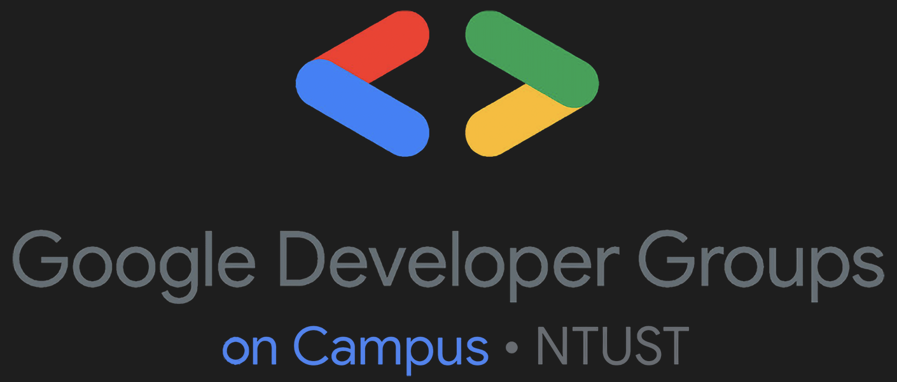

<div align="center">

# 🍌 一起在 Discord 玩 AI 奈米香蕉！ 🍌

[](https://gdg-ntust.org/)

<br>[](https://opensource.org/licenses/MIT)
[](https://ai.google.dev/)
[](https://ai.google.dev/)

[](https://www.python.org/)
[](https://github.com/Pycord-Development/pycord)
[](https://pydantic.dev/latest/)

繁體中文 | **[English](README.md)**

</div>

## 概述

Nano Banana 是一個展示如何使用 Google Gemini API 進行 AI 圖像生成的教學專案。透過 Discord 機器人介面，使用者可以：

- 🎨 **文字生成圖像** - 從文字描述創建圖像
- 🔄 **圖像轉換** - 根據指令修改現有圖像
- 💬 **Discord 整合** - 透過斜線命令或訊息互動

### 技術特點

- 清晰的模組化架構（配置、API、Discord 層分離）
- 完整的非同步程式設計實踐
- 使用 Pydantic 進行配置管理
- 完整的測試覆蓋（pytest + pytest-asyncio）
- 使用 uv 進行快速依賴管理

## 快速開始

### 前置需求

- Python 3.13+
- [Google Gemini API Key](https://ai.google.dev/)
- [Discord Bot Token](https://discord.com/developers/applications)

### 安裝

```bash
# 安裝 uv 套件管理器
pip install uv

# 克隆專案
git clone https://github.com/GDG-NTUST/course-1141-9.git
cd course-1141-9

# 安裝依賴
uv sync
```

### 配置

建立 `.env` 檔案：

```env
GOOGLE_API_KEY=your_google_api_key
DISCORD_TOKEN=your_discord_bot_token
DISCORD_GUILD_ID=your_server_id

# 可選配置
LOG_LEVEL=INFO
MODEL_NAME=gemini-2.5-flash-image
SYSTEM_PROMPT=你是一個樂於助人的 AI 助手。
```

### 執行

```bash
# 啟動 Discord 機器人
cd src/
uv run nano_banana
```

## 使用方式

### Discord 機器人

**斜線命令：**
```
/畫圖 一隻戴帽子的貓
```

**訊息互動：**
- 直接發送文字訊息生成圖像
- 附加圖片並加上文字指令進行圖像轉換
- 支援回覆訊息中的圖片

### 命令列 Demo

```bash
cd src/

# 文字生成圖像
uv run nano_banana_cli -p "美麗的日落"

# 圖像轉換
uv run nano_banana_cli -p "讓它更鮮豔" -i image.png

# 多圖像處理
uv run nano_banana_cli -p "結合這些風格" -i img1.png img2.png
```

生成的圖像儲存在 `src/nano_banana/api/demo/outputs/`

## 專案架構

```
nano_banana/
├── core/
│   └── config.py          # Pydantic 配置管理
├── api/
│   ├── client.py          # Google Gemini API 客戶端
│   └── demo/
│       └── demo.py        # 命令列 demo
└── discord/
    ├── bot.py             # Discord 機器人
    └── utils.py           # 工具函數
```

### 核心模組

- **`config.py`** - 環境變數載入、日誌配置、設定驗證
- **`client.py`** - 非同步 Gemini API 客戶端，支援文字轉圖像和圖像轉換
- **`bot.py`** - Discord 機器人，處理斜線命令和訊息事件
- **`utils.py`** - 圖像下載和回應處理工具

## 測試

```bash
# 安裝開發依賴
uv sync

# 執行所有測試
uv run pytest

# 執行測試並生成覆蓋率報告
uv run pytest --cov=nano_banana --cov-report=html

# 執行特定測試
uv run pytest tests/api/test_client.py
```

測試覆蓋範圍：
- ✅ 配置管理（環境變數、驗證、預設值）
- ✅ API 客戶端（文字轉圖像、圖像轉換、錯誤處理）
- ✅ Discord 機器人（命令處理、訊息監聽、圖片附件）
- ✅ 工具函數（圖像下載、回應格式化）

## 開發

### 程式碼品質

```bash
# 格式化程式碼
uv run ruff format .

# 執行 linter
uv run ruff check . --fix
```

### 專案配置

- **Ruff** - 程式碼檢查和格式化
- **pytest** - 測試框架
- **pytest-asyncio** - 非同步測試支援
- **pytest-cov** - 測試覆蓋率

詳細配置請參考 `pyproject.toml`

## 支援的模型

| 模型名稱 | 最大圖片數 |
|---------|-----------|
| `gemini-2.5-flash-image` | 3 |
| `gemini-3-pro-image-preview` | 14 |

在 `.env` 中設定 `MODEL_NAME` 來切換模型。

## 故障排除

**API 金鑰錯誤：**
- 確認 `.env` 檔案存在且格式正確
- 檢查 API 金鑰是否有效且有配額

**Discord 機器人無回應：**
- 確認機器人已上線
- 檢查 Discord Token 是否正確
- 確認已啟用 Message Content Intent
- 驗證 DISCORD_GUILD_ID 設定正確

**啟用除錯日誌：**
```env
LOG_LEVEL=DEBUG
```

## 授權

本專案採用 [MIT License](LICENSE)

## 貢獻

歡迎提交 Pull Request 或開啟 Issue！

---

<div align="center">

由 [GDG NTUST](https://gdg-ntust.org/) 製作 ❤️

</div>
